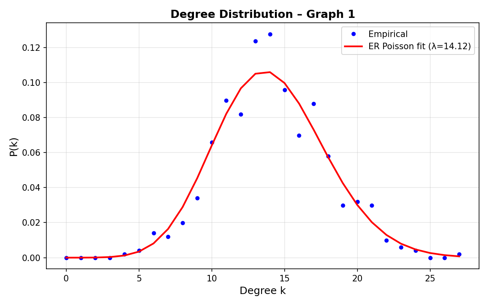
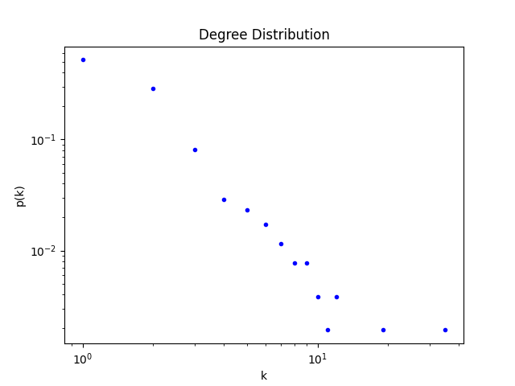

# Lab 7

## 1 Degree Distribution
### a)
Hypothesis : 
Graphically, we can hypothese that the first graph is binomially distributed due to its bell curve degree structure, whereas the second graph seems to be a power-law.

#### Plot of Degree Distribution Graph 1

#### Plot of Degree Distribution Graph 2

- Average Degree Graph 1: 14.12
- Average Degree Graph 2: 2.1

- Maximum Degree Graph 1: Node 419, Degree 27
- Maximum Degree Graph 2: Node 180, Degree 35

- Standard Deviation Graph 1: 3.63
- Standard Deviation Graph 2: 2.36

Comparing these values with the Distribution plots above, we can cleary see that the distribution of Graph 1 centers around 14 most values fall into the standard deviation of 3.63. This goes for Graph 2 as well.

Classifying these plots is straighforward just by looking at the graphs distribution plots (bellcurve)